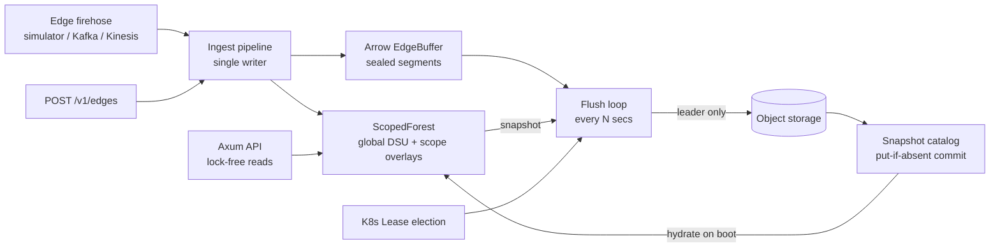
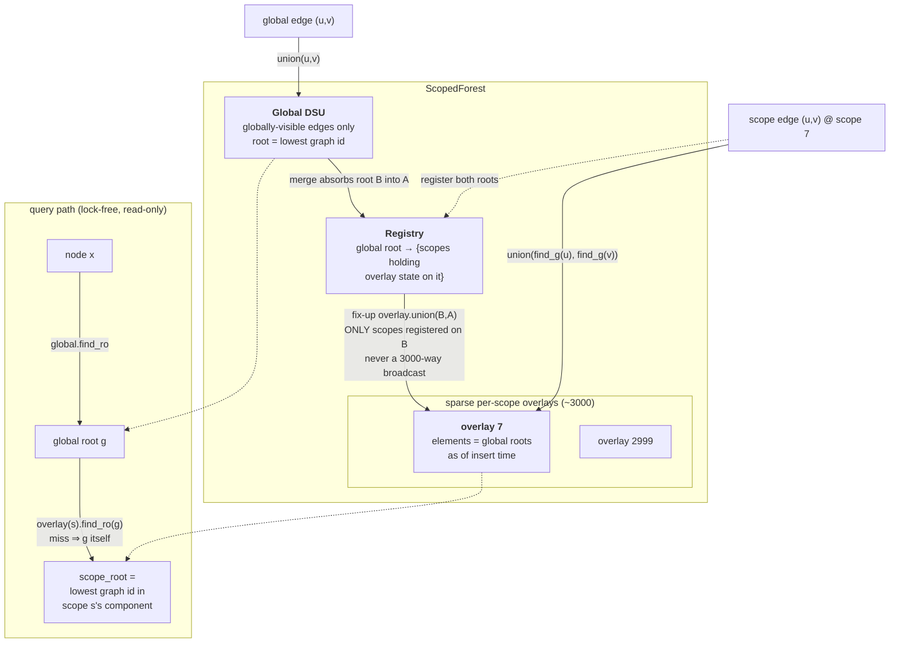
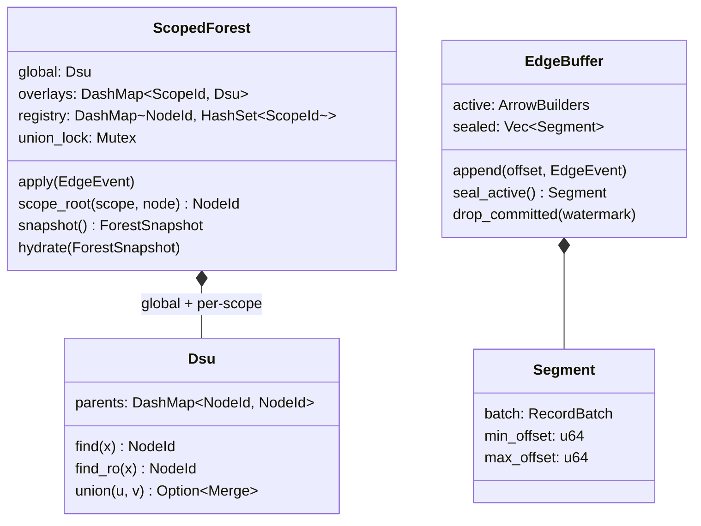

# blaze architecture



Each worker runs four cooperating pieces over shared in-memory state:

1. **Ingest pipeline** (`src/ingest/pipeline.rs`) — a single task drains the
   event channel, assigns monotonic offsets, applies DSU merges, appends rows
   to Arrow builders.
2. **Query API** (`src/api`) — Axum handlers doing lock-free DSU finds; no
   ingest lock is ever taken on the query path.
3. **Flush loop** (`src/storage/flush.rs`) — seals Arrow buffers each tick;
   the leader persists and commits.
4. **Leader election** (`src/ha`) — Kubernetes Lease (feature `k8s`) or
   static assignment.

## The multi-tenant scoping problem

Edges carry visibility: **global** (all tenants) or a small set of the
~3000 **scopes**. Scope `s`'s connectivity is defined over
`G_global ∪ G_s` — so tenant views share the global backbone but never see
each other's private edges.

Naive designs fail at this cardinality:

- *One DSU per scope*: a single global edge must be applied to ~3000
  structures — O(scopes) per global event.
- *Normalize-at-read overlays* (overlay keyed by global roots, resolved
  through `global.find` at query time): subtly wrong — when a global merge
  absorbs root `B` into `A`, overlay state keyed at `B` becomes unreachable
  from lookups that start at the live root `A`.

### Layered DSU with merge notifications (`src/core/scoped.rs`)



Reading the diagram: writes enter at the top (global edges touch one
structure; scope edges touch one overlay plus two registry entries), the
registry turns global merges into targeted fix-ups instead of broadcasts,
and queries compose the two layers left-to-right with the overlay lookup
falling back to the global root on a miss.

- **Global DSU**: holds globally-visible edges only.
- **Scope overlay DSU** (sparse, per scope): elements are node ids that were
  *global roots when the scope edge arrived*. A scope edge `(u,v)` unions
  `find_g(u)` and `find_g(v)` in the overlay.
- **Registry** `global_root -> {scopes}`: every overlay insertion registers
  its keys. When a global union absorbs root `B` into `A`, only the scopes
  registered on `B` get a fix-up `overlay.union(B, A)` — recording that the
  two overlay elements now denote the same global component — and `B`'s
  registrations migrate to `A`.

Query composition (lock-free, read-only):

```text
scope_root(s, x) = overlay(s).find_ro(global.find_ro(x))   // falls back to global root
connected(s, u, v) = scope_root(s, u) == scope_root(s, v)
```

**Canonical roots — lowest graph id wins.** Both layers union by minimum id,
so `scope_root` returns the smallest graph id in the component as seen by
that scope: deterministic, and only ever decreasing as merges land (trending
toward stable ids for long-lived graphs). The property survives the overlay
because every global fix-up inserts the new, lower global root as an overlay
element, keeping the overlay class min equal to the true component min. The
randomized test asserts `scope_root == BFS component minimum` on every
check.

Cost model: a global merge pays only for scopes that actually reference the
absorbed root (typically zero or a handful, never a 3000-way broadcast);
scope edges pay O(α) in their own overlay. Correctness is enforced by a
randomized test that checks every answer against a per-scope BFS reference
model, including across snapshot/hydrate cycles.

### Concurrency model

- All **unions** (global, scoped, fix-ups) serialize behind one mutex —
  mutation rate is bounded by ingest, and a mutex uncontended by queries
  costs nanoseconds.
- **Write-path finds** compress via path-halving; halving writes are safe
  under races because a parent pointer is only ever replaced by another
  ancestor. **Query-path finds** (`find_ro`) are read-only walks — taking
  only shard read locks so query load cannot starve the single writer — with
  one repair write if a walk exceeds a depth threshold, capping pathological
  chains.
- Queries racing a multi-step union may observe pre-fix-up state for
  microseconds — the read-your-own-stream guarantee is eventual within a
  tick, which is the right trade for a streaming engine.

## Data model

### Event model (`src/core/types.rs`)

```rust
EdgeEvent {
    src: u64,                 // graph/node id
    dst: u64,
    visibility: Global        // every scope sees it
              | Scoped([u32]) // listed scopes only; [] or containing 0
                              // normalizes to Global; sorted + deduped
    event_time_ms: i64,
    props: Option<String>,    // opaque JSON, carried end to end
}
```

Scope ids are `u32` with `0 = GLOBAL_SCOPE`. Node ids are sparse `u64`;
nothing is paid for ids that never appear in an edge.

### In-memory state



Key representation choices: a node absent from `parents` is a root (or a
never-seen singleton — identical semantics); overlay elements are node ids
that were global roots at insert time; the registry is the merge-notification
index. `ForestSnapshot` is the neutral exchange form:
`{ global: Vec<(node, root)>, scopes: Vec<(scope_id, Vec<(node, root)>)> }`
with every pair fully resolved (depth 1) at capture time.

### Warehouse layout (object storage)

```text
<table_prefix>/                          e.g. graph/edges/
├── data/part-<seq12>-<uuid>.parquet     edge rows (immutable)
├── puffin/dsu-<seq12>.puffin            routing sidecar (immutable)
└── metadata/snap-<seq12>.json           atomic commit point (put-if-absent)
```

### Edge Parquet schema (one row per event × visible scope)

| column | type | notes |
|---|---|---|
| `offset` | u64 | stream position; replay/dedupe key |
| `src`, `dst` | u64 | edge endpoints |
| `scope_id` | u32 | 0 = global; rows sorted by `(scope_id, src)` for pruning |
| `event_time` | timestamp(ms) | event time |
| `props` | utf8, nullable | opaque JSON |

zstd-compressed, one row group per sealed segment.

### Puffin sidecar (`src/storage/puffin.rs`, `codec.rs`)

```text
container:  "PFA1" | blob₀ … blobₙ | "PFA1" | footer JSON | len:u32 LE | flags:u32 | "PFA1"
blob types: blaze-global-dsu-v1                  (one)
            blaze-scope-dsu-v1 {scope-id: "N"}   (one per active scope)
payload:    count:u64 LE, then count × (node:u64 LE, root:u64 LE)
            sorted by node — binary-searchable in place / via mmap
```

Roots in the payload are canonical (lowest graph id in the component as of
this snapshot). Unknown blob types are ignored on read — the forward-compat
hook the delta design (docs/design/001) extends with `*-delta-v1` types.

### Snapshot metadata (`metadata/snap-*.json`)

```json
{
  "sequence": 42,               // dense, monotonically increasing
  "committed_at_ms": 1753000000000,
  "watermark": 379601,          // highest event offset covered (inclusive)
  "data_files": [ { "path", "rows", "bytes", "min_offset", "max_offset" } ],
  "puffin_path": "graph/edges/puffin/dsu-000000000042.puffin",
  "committer": "worker-pod-abc"
}
```

The watermark is the contract tying the three artifacts together: data
files cover offsets ≤ watermark, the Puffin routing map reflects exactly
those events, and followers prune buffered segments ≤ watermark.

## Ingest and buffering (`src/ingest`)

Events are exploded to one Arrow row per visible scope
(`offset, src, dst, scope_id, event_time, props_json`, global = scope 0), so
Parquet gets a plain `scope_id` column for predicate pushdown. On every
flush tick the active builders rotate into an immutable **sealed segment**
tagged `[min_offset, max_offset]`, sorted by `(scope_id, src)` for row-group
clustering.

Offsets are the replication contract: with a real log (Kafka/Kinesis) they
are the log's offsets and identical on every replica; the built-in simulator
assigns them locally.

## Persistence (`src/storage`)

Every tick, every worker: seal + read `catalog.latest()` + drop sealed
segments `<= watermark` (followers garbage-collect what the leader already
committed). The leader additionally:

1. writes sealed segments as one **Parquet** file
   (`data/part-<seq>-<uuid>.parquet`, zstd, row group per segment);
2. snapshots the forest into a **Puffin** file
   (`puffin/dsu-<seq>.puffin`) — spec-compliant `PFA1` container
   (`src/storage/puffin.rs`), one `blaze-global-dsu-v1` blob plus one
   `blaze-scope-dsu-v1` blob per active scope, each a sorted
   `(node, root)` pair table for O(1) topological routing without replay;
3. commits `metadata/snap-<seq>.json` with **put-if-absent** — the atomic
   publish. A lost race (leadership handoff) leaves harmless orphan files,
   exactly like uncommitted Iceberg data files, and segments re-flush next
   tick: at-least-once writes, exactly-once visibility.

On boot a worker hydrates the forest from the latest snapshot's Puffin blobs
(`hydrate_from_catalog`) and resumes offsets at the committed watermark —
recovery cost is proportional to live topology, not history. The catalog is
deliberately shaped like an Iceberg commit; swapping in an Iceberg REST
catalog changes `SnapshotCatalog` only.

## High availability (`src/ha`)

All replicas ingest and serve. `LeaderElector` decides who commits:
`StaticElector` for standalone/tests, and Lease-based election
(`coordination.k8s.io/v1`, feature `k8s`) renewing at a third of the lease
duration, with expired-lease takeover and `resourceVersion` CAS so two
candidates cannot both win. Failover safety: the catalog's put-if-absent is
the last line of defense even if two workers briefly both believe they lead.

## Capacity planning (measured)

Memory is paid per *tracked link* — a global merge or a scope-overlay union —
never per id: the node space is sparse `u64` and untouched nodes are free.
Measured on the reference workload (15M events, 30M node space, 3000 scopes,
15% global):

- **~200 bytes per tracked link** (DashMap parents + overlay + registry):
  15M links = ~3 GB resident. A 64 GB worker sustains ~250M links; the
  registry's per-root scope sets are the first thing to slim if more is
  needed.
- **Full snapshot cost is the practical per-worker ceiling**, not memory:
  15M links snapshot in ~3.5s *holding the union lock* (ingest stalls),
  encode in ~2.2s off-lock, and produce a ~256 MB Puffin payload. Cost is
  linear, so ~50M links ≈ 12s stall per flush tick — the comfortable
  envelope with 60s full snapshots is **tens of millions of tracked links
  per worker**.
- Beyond that, the format is ready for **delta snapshots**: Puffin blobs are
  sequence-numbered, so a flush can write only pairs changed since the last
  snapshot with periodic full compaction, removing both the stall and the
  rewrite. That, or shard workers by node-id range.

## Next phase

Implementation-ready designs for the next phase — delta snapshots, dense id
interning, the disk-backed routing base, and analytics enrichment — live in
[docs/design/](docs/design/README.md), sized against the target production
profile (~2B tracked nodes, ~3k events/s peak).

## Extension points

- **gRPC** (`src/grpc`): a tonic `BlazeService` over the same `AppState` as
  the Axum API, served on a second port (`--grpc-listen`). The query RPCs stay
  lock-free (`forest.scope_root` / `forest.connected`) and `InjectEdge` feeds
  the same ingest channel as `POST /v1/edges`. The proto is compiled in
  `build.rs` with the pure-Rust `protox` compiler, so no `protoc` is needed.
- **Log sources**: implement a consumer feeding the pipeline channel with
  log-native offsets.
- **Iceberg REST catalog**: replace `SnapshotCatalog` commit/latest.
- **Query-side reads of history**: Parquet files are sorted and
  scope-partitioned; DataFusion can serve historical queries with the Puffin
  routing map providing current component ids.
