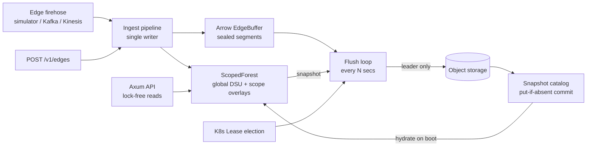

# blaze architecture



Each worker runs four cooperating pieces over shared in-memory state:

1. **Ingest pipeline** (`src/ingest/pipeline.rs`) — a single task drains the
   event channel, assigns monotonic offsets, applies DSU merges, appends rows
   to Arrow builders.
2. **Query API** (`src/api`) — Axum handlers doing lock-free DSU finds; no
   ingest lock is ever taken on the query path.
3. **Flush loop** (`src/storage/flush.rs`) — seals Arrow buffers each tick;
   the leader persists and commits.
4. **Leader election** (`src/ha`) — Kubernetes Lease (feature `k8s`) or
   static assignment.

## The multi-tenant scoping problem

Edges carry visibility: **global** (all tenants) or a small set of the
~3000 **scopes**. Scope `s`'s connectivity is defined over
`G_global ∪ G_s` — so tenant views share the global backbone but never see
each other's private edges.

Naive designs fail at this cardinality:

- *One DSU per scope*: a single global edge must be applied to ~3000
  structures — O(scopes) per global event.
- *Normalize-at-read overlays* (overlay keyed by global roots, resolved
  through `global.find` at query time): subtly wrong — when a global merge
  absorbs root `B` into `A`, overlay state keyed at `B` becomes unreachable
  from lookups that start at the live root `A`.

### Layered DSU with merge notifications (`src/core/scoped.rs`)

- **Global DSU**: holds globally-visible edges only.
- **Scope overlay DSU** (sparse, per scope): elements are node ids that were
  *global roots when the scope edge arrived*. A scope edge `(u,v)` unions
  `find_g(u)` and `find_g(v)` in the overlay.
- **Registry** `global_root -> {scopes}`: every overlay insertion registers
  its keys. When a global union absorbs root `B` into `A`, only the scopes
  registered on `B` get a fix-up `overlay.union(B, A)` — recording that the
  two overlay elements now denote the same global component — and `B`'s
  registrations migrate to `A`.

Query composition (lock-free):

```text
scope_root(s, x) = overlay(s).find(global.find(x))   // falls back to global root
connected(s, u, v) = scope_root(s, u) == scope_root(s, v)
```

Cost model: a global merge pays only for scopes that actually reference the
absorbed root (typically zero or a handful, never a 3000-way broadcast);
scope edges pay O(α) in their own overlay. Correctness is enforced by a
randomized test that checks every answer against a per-scope BFS reference
model, including across snapshot/hydrate cycles.

### Concurrency model

- All **unions** (global, scoped, fix-ups) serialize behind one mutex —
  mutation rate is bounded by ingest, and a mutex uncontended by queries
  costs nanoseconds.
- All **finds** are lock-free DashMap walks with path-halving; halving
  writes are safe under races because a parent pointer is only ever replaced
  by another ancestor.
- Queries racing a multi-step union may observe pre-fix-up state for
  microseconds — the read-your-own-stream guarantee is eventual within a
  tick, which is the right trade for a streaming engine.

## Ingest and buffering (`src/ingest`)

Events are exploded to one Arrow row per visible scope
(`offset, src, dst, scope_id, event_time, props_json`, global = scope 0), so
Parquet gets a plain `scope_id` column for predicate pushdown. On every
flush tick the active builders rotate into an immutable **sealed segment**
tagged `[min_offset, max_offset]`, sorted by `(scope_id, src)` for row-group
clustering.

Offsets are the replication contract: with a real log (Kafka/Kinesis) they
are the log's offsets and identical on every replica; the built-in simulator
assigns them locally.

## Persistence (`src/storage`)

Every tick, every worker: seal + read `catalog.latest()` + drop sealed
segments `<= watermark` (followers garbage-collect what the leader already
committed). The leader additionally:

1. writes sealed segments as one **Parquet** file
   (`data/part-<seq>-<uuid>.parquet`, zstd, row group per segment);
2. snapshots the forest into a **Puffin** file
   (`puffin/dsu-<seq>.puffin`) — spec-compliant `PFA1` container
   (`src/storage/puffin.rs`), one `blaze-global-dsu-v1` blob plus one
   `blaze-scope-dsu-v1` blob per active scope, each a sorted
   `(node, root)` pair table for O(1) topological routing without replay;
3. commits `metadata/snap-<seq>.json` with **put-if-absent** — the atomic
   publish. A lost race (leadership handoff) leaves harmless orphan files,
   exactly like uncommitted Iceberg data files, and segments re-flush next
   tick: at-least-once writes, exactly-once visibility.

On boot a worker hydrates the forest from the latest snapshot's Puffin blobs
(`hydrate_from_catalog`) and resumes offsets at the committed watermark —
recovery cost is proportional to live topology, not history. The catalog is
deliberately shaped like an Iceberg commit; swapping in an Iceberg REST
catalog changes `SnapshotCatalog` only.

## High availability (`src/ha`)

All replicas ingest and serve. `LeaderElector` decides who commits:
`StaticElector` for standalone/tests, and Lease-based election
(`coordination.k8s.io/v1`, feature `k8s`) renewing at a third of the lease
duration, with expired-lease takeover and `resourceVersion` CAS so two
candidates cannot both win. Failover safety: the catalog's put-if-absent is
the last line of defense even if two workers briefly both believe they lead.

## Extension points

- **gRPC**: the API layer is a plain `axum::Router`; a tonic service over
  the same `AppState` can be served on a second port.
- **Log sources**: implement a consumer feeding the pipeline channel with
  log-native offsets.
- **Iceberg REST catalog**: replace `SnapshotCatalog` commit/latest.
- **Query-side reads of history**: Parquet files are sorted and
  scope-partitioned; DataFusion can serve historical queries with the Puffin
  routing map providing current component ids.
